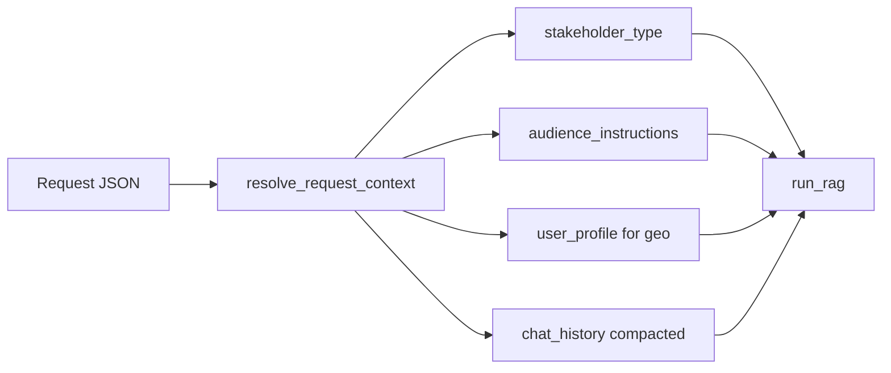

# Align both APIs to nested user_profile + chat_history

## Target request contract (backend canonical)

**`POST /query`:**

```json
{
  "query": "What are rice yield trends?",
  "session_id": "abc123...",
  "user_profile": {
    "country": "Ghana",
    "audience_instructions": null,
    "stakeholder_type": "farmers_communities"
  },
  "chat_history": [
    { "role": "user", "content": "Previous question" },
    { "role": "assistant", "content": "Previous answer" }
  ],
  "include_trace": false
}
```

**`POST /v1/chat`:** same nesting; user text via **`query`** or **`message`** (either required).

Responses unchanged (`answer` / `assistant_message`, `citations`, `usage`, `session_id`).



## 1. Shared models and resolver — new [`ml/rag/request_context.py`](ml-eng/ml/rag/request_context.py)

### Expand [`UserProfile`](ml-eng/ml/rag/api_schemas.py)

```python
class UserProfile(BaseModel):
    country: str | None = None
    stakeholder_type: str | None = None
    audience_instructions: str | None = Field(None, max_length=4000)
```

### `ResolvedRequestContext` dataclass + `resolve_request_context(...)`

Single function used by both APIs:

| Output | Resolution order |
|--------|------------------|
| `stakeholder_type` | `user_profile.stakeholder_type` → deprecated top-level → session blob (v1/chat_turn only) |
| `audience_instructions` | `user_profile.audience_instructions` → deprecated top-level |
| `user_profile` dict for `run_rag` | `{"country": profile.country}` (geo policy unchanged) |
| `chat_history` | `chat_history` → deprecated `conversation_history` |

Validate `stakeholder_type` with [`is_valid_stakeholder_type`](ml-eng/ml/rag/chatbot/stakeholder_prompts.py); invalid → raise `ValueError` (handlers return 422).

Helper: `effective_chat_history(request)` returns `list[ChatMessage] | None`.

## 2. `POST /query` — [`ml/rag/app/api.py`](ml-eng/ml/rag/app/api.py)

- Add `chat_history: list[ChatMessage] | None` to `QueryRequest`.
- Mark `conversation_history`, top-level `stakeholder_type`, and top-level `audience_instructions` as **deprecated** (still accepted as fallbacks).
- Refactor `_resolve_prior_memory` to use `effective_chat_history(request)` instead of only `conversation_history`.
- In `query()` handler:
  - Call `resolve_request_context(...)` with profile, history, session_id, legacy top-level fields.
  - Pass resolved `stakeholder_type`, `audience_instructions`, `user_profile` into `run_rag`.
  - Session persist when `chat_history` and `conversation_history` are both absent (unchanged semantics).
- Update logging/trace to use resolved stakeholder + `bool(history)`.

## 3. `POST /v1/chat` — [`ml/serving/chat/schemas.py`](ml-eng/ml/serving/chat/schemas.py) + [`app.py`](ml-eng/ml/serving/chat/app.py) + [`chat_turn.py`](ml-eng/ml/rag/chat_turn.py)

### `ChatRequest` schema

- Add `query: str | None = None` and keep `message: str | None = None` — **`@model_validator`**: exactly one of `query` / `message` required (min length 1).
- Add `chat_history: list[ChatMessage] | None`; deprecate `conversation_history`.
- Expand `user_profile` via shared `UserProfile` (stakeholder + audience nested).
- Deprecate top-level `stakeholder_type`; relax validator:
  - **Still forbid** `session_id` + top-level `stakeholder_type` (legacy bootstrap path).
  - **Allow** `session_id` + `user_profile.stakeholder_type` (backend sends profile every turn).

### `v1_chat` handler

- Resolve user text: `body.query or body.message`.
- Call shared `resolve_request_context` (with session blob lookup via existing `chat_turn` logic).
- Bootstrap without `session_id`: if no session yet, require `user_profile.stakeholder_type` or deprecated top-level `stakeholder_type` (same as today’s bootstrap rule).
- Pass `chat_history` into `execute_chat_turn` (rename param internally to accept either name; keep `conversation_history` as deprecated alias in `execute_chat_turn` signature).

### `execute_chat_turn`

- Add `chat_history` param; treat `chat_history or conversation_history`.
- Accept resolved `stakeholder_type`, `audience_instructions`, `user_profile` from caller (or resolve inside if cleaner — prefer caller resolves once in `app.py`).

## 4. Precedence rules (document in README)

1. **`user_profile.stakeholder_type`** wins for this turn’s generation tone (over session blob when both present).
2. **`user_profile.country`** → retrieval filter only when resolved stakeholder is `farmers_communities` ([`geo_policy.py`](ml-eng/ml/rag/chatbot/geo_policy.py) — no change).
3. **`chat_history` present** → use for memory this turn; do not persist to server session.
4. **`chat_history` absent** → load/persist server session via `session_id`.

## 5. Tests

New [`ml/rag/test_request_context.py`](ml-eng/ml/rag/test_request_context.py):

- Nested profile resolves stakeholder + audience.
- `chat_history` preferred over `conversation_history`.
- Top-level fallbacks still work.
- Invalid `stakeholder_type` raises.
- Farmer profile country flows to geo dict.

Update or add API tests:

- `QueryRequest` with backend-shaped JSON → handler kwargs correct (mock `run_rag`).
- `ChatRequest` accepts `query` OR `message`; rejects neither / both empty.
- v1: `session_id` + `user_profile.stakeholder_type` does not 422.

## 6. Docs

Update [`ml/rag/README.md`](ml-eng/ml/rag/README.md) and [`ml/serving/README.md`](ml-eng/ml/serving/README.md):

- Canonical request examples (nested `user_profile`, `chat_history`).
- Note deprecated fields: `conversation_history`, top-level `stakeholder_type` / `audience_instructions`, `geo_override`.
- v1/chat: `query` and `message` are interchangeable.

## Backward compatibility

| Legacy field | Behavior |
|--------------|----------|
| `conversation_history` | Alias for `chat_history` |
| Top-level `stakeholder_type` / `audience_instructions` | Fallback if not in `user_profile` |
| `geo_override` | Still ignored |
| v1 top-level `stakeholder_type` without `session_id` | Bootstrap still works |

## Files to touch

| File | Change |
|------|--------|
| [`api_schemas.py`](ml-eng/ml/rag/api_schemas.py) | Expand `UserProfile` |
| [`request_context.py`](ml-eng/ml/rag/request_context.py) | **New** shared resolver |
| [`app/api.py`](ml-eng/ml/rag/app/api.py) | `chat_history`, use resolver |
| [`chat_turn.py`](ml-eng/ml/rag/chat_turn.py) | `chat_history` alias param |
| [`serving/chat/schemas.py`](ml-eng/ml/serving/chat/schemas.py) | `query`/`message`, `chat_history`, validator |
| [`serving/chat/app.py`](ml-eng/ml/serving/chat/app.py) | Use resolver |
| [`test_request_context.py`](ml-eng/ml/rag/test_request_context.py) | **New** |
| READMEs | Canonical contract |
