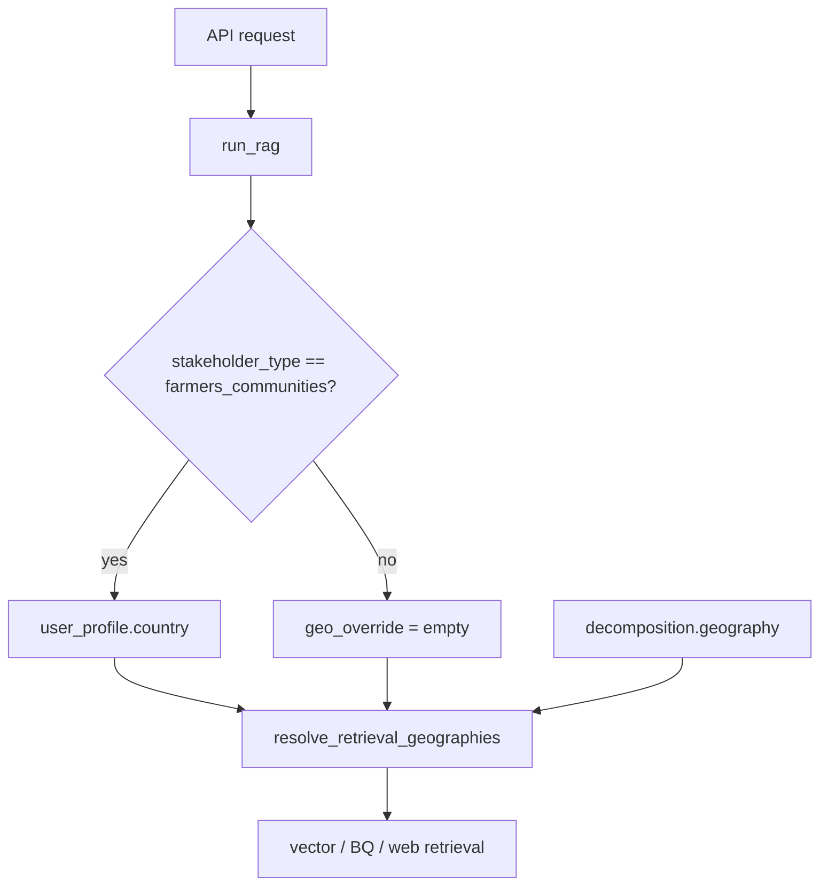

# Farmer-only profile country for retrieval

## Current behavior (problem)

[`resolve_retrieval_geographies`](ml-eng/ml/rag/chatbot/query_decomposer.py) treats any non-empty `geo_override` as a hard retrieval filter across **all** corpora (news, research, BQ, web fallback) via [`graph.py`](ml-eng/ml/rag/chatbot/graph.py):

```228:231:ml-eng/ml/rag/chatbot/graph.py
    countries = resolve_retrieval_geographies(
        geo_override=str(state.get("geo_override") or ""),
        geography=dec.get("geography") if isinstance(dec.get("geography"), list) else None,
    )
```

There is **no** `user_profile` field today. AskADZA/backend may be sending profile country as `geo_override`, which incorrectly constrains retrieval for government, private sector, etc.

## Target behavior

| Stakeholder | Retrieval geo source |
|-------------|---------------------|
| `farmers_communities` | `user_profile.country` (if set), else query decomposition |
| All others | Query decomposition only |
| `geo_override` (API) | **Ignored** (deprecated) |

Profile country must **not** affect generation tone or stakeholder prompts — retrieval filter only.



## 1. Geo policy helper

Add [`ml/rag/chatbot/geo_policy.py`](ml-eng/ml/rag/chatbot/geo_policy.py) (small, testable):

- `FARMER_STAKEHOLDER = "farmers_communities"`
- `profile_country_for_retrieval(stakeholder_type: str | None, user_profile: dict | None) -> str`
  - Returns stripped `user_profile["country"]` only when `stakeholder_type == farmers_communities`
  - Otherwise returns `""`
- `effective_geo_override(stakeholder_type, user_profile) -> str` — thin alias used by `run_rag`

Reuse existing [`normalize_geography_for_filter`](ml-eng/ml/rag/chatbot/query_decomposer.py) / continent rejection when profile country is a region token.

## 2. Centralize in `run_rag`

In [`ml/rag/chatbot/graph.py`](ml-eng/ml/rag/chatbot/graph.py) `run_rag()`:

- Accept optional `user_profile: dict | None` in kwargs (not a graph state field unless needed for tracing).
- **Before** `graph.invoke`, set:
  ```python
  initial["geo_override"] = effective_geo_override(
      kwargs.get("stakeholder_type"),
      kwargs.get("user_profile"),
  ) or None
  ```
- **Remove** `geo_override` from the kwargs→state copy loop so callers cannot bypass the policy.
- Ensure `stakeholder_type` is always passed into graph state (already in loop at line 803).

No changes needed inside individual retrieve nodes — they already read `state["geo_override"]`.

## 3. API: add `user_profile`, deprecate `geo_override`

### Shared model — [`ml/rag/api_schemas.py`](ml-eng/ml/rag/api_schemas.py)

```python
class UserProfile(BaseModel):
    country: str | None = None
```

### `POST /query` — [`ml/rag/app/api.py`](ml-eng/ml/rag/app/api.py)

- Add `user_profile: UserProfile | None = None` to `QueryRequest`.
- Mark `geo_override` as deprecated in Field description; **do not forward** to `run_rag`.
- Pass `user_profile=request.user_profile.model_dump() if request.user_profile else None` into `run_rag`.
- Optional: log at debug when `geo_override` is sent anyway (migration signal).

### `POST /v1/chat` — [`ml/serving/chat/schemas.py`](ml-eng/ml/serving/chat/schemas.py) + [`chat_turn.py`](ml-eng/ml/rag/chat_turn.py)

- Add `user_profile: UserProfile | None` to `ChatRequest`.
- Thread through `execute_chat_turn(..., user_profile=...)` → `run_rag`.

## 4. Streamlit / dev UI

[`ml/rag/chatbot/streamlit_app.py`](ml-eng/ml/rag/chatbot/streamlit_app.py):

- Replace the geography override text input with a **profile country** field used only when a stakeholder selector is set to `farmers_communities` (or hide it for other personas).
- Stop sending `geo_override` in kwargs.

## 5. Tests

New [`ml/rag/chatbot/test_geo_policy.py`](ml-eng/ml/rag/chatbot/test_geo_policy.py):

- `farmers_communities` + `user_profile.country="Nigeria"` → returns `"Nigeria"`
- `government_public` + same profile → returns `""`
- Empty/missing profile → returns `""`
- Region token in profile (e.g. `"Africa"`) → returns `""` or filtered per `_NON_COUNTRY_GEO`

Optional integration-style test mocking `run_rag` initial state: verify `geo_override` not set from deprecated request field.

## 6. Docs

Update [`ml/rag/README.md`](ml-eng/ml/rag/README.md) and [`ml/serving/README.md`](ml-eng/ml/serving/README.md):

- Document `user_profile.country` semantics (farmers-only retrieval filter).
- State `geo_override` is deprecated/ignored; backend should send profile country via `user_profile`, not `geo_override`.
- Non-farmer retrieval geography comes from the user query via decomposer (`geography` in decomposition).

## Backend integration note (for AskADZA)

```json
{
  "query": "What are rice yield trends?",
  "session_id": "...",
  "stakeholder_type": "farmers_communities",
  "user_profile": { "country": "Nigeria" }
}
```

For `government_public` / others, send `user_profile` if you want (ignored for retrieval) or omit it; do **not** map profile country to `geo_override`.

## Files to touch

| File | Change |
|------|--------|
| [`geo_policy.py`](ml-eng/ml/rag/chatbot/geo_policy.py) | **New** — farmer-only profile geo |
| [`graph.py`](ml-eng/ml/rag/chatbot/graph.py) | `run_rag` sets `geo_override` from policy; drop raw override |
| [`api_schemas.py`](ml-eng/ml/rag/api_schemas.py) | `UserProfile` model |
| [`app/api.py`](ml-eng/ml/rag/app/api.py) | `user_profile` on request; ignore `geo_override` |
| [`chat_turn.py`](ml-eng/ml/rag/chat_turn.py) | Pass `user_profile` |
| [`serving/chat/schemas.py`](ml-eng/ml/serving/chat/schemas.py) | `user_profile` on `ChatRequest` |
| [`streamlit_app.py`](ml-eng/ml/rag/chatbot/streamlit_app.py) | Align dev UI |
| Tests + README | As above |
