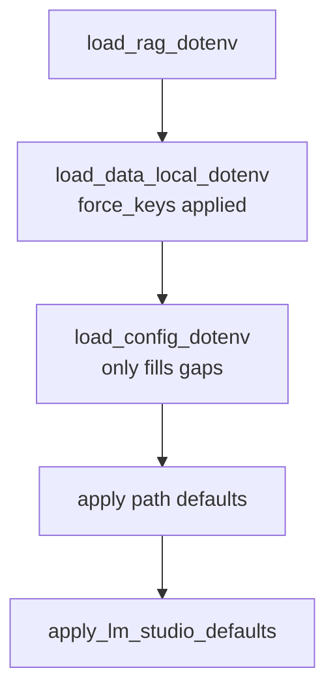
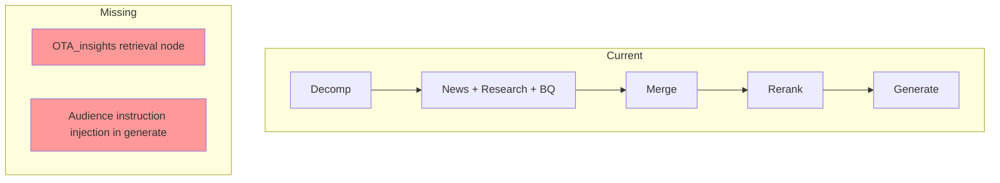
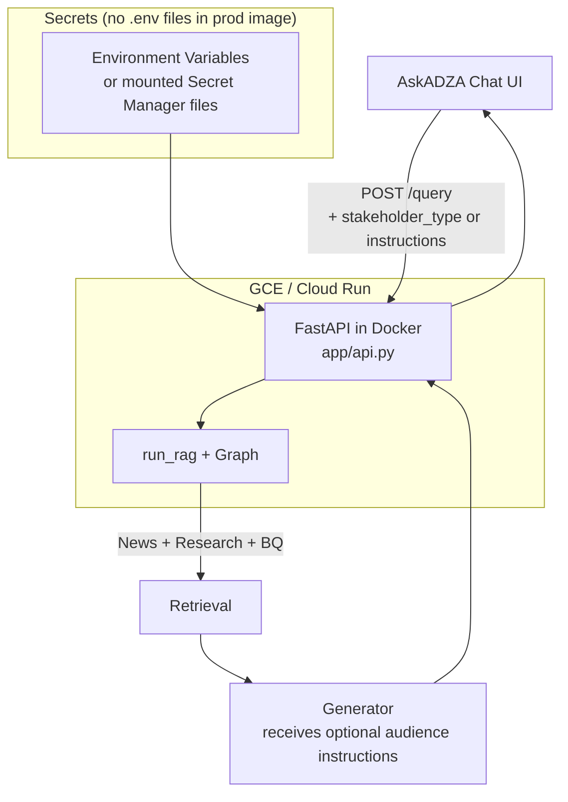
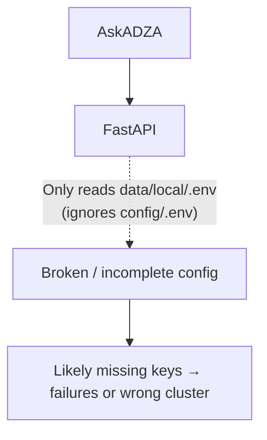

# RAG Production API, Docker & GCE Handoff Readiness Plan

**Ultimate Goal (per user, 30 May 2026)**: Produce a complete, wholesome, Dockerized RAG service that can be deployed on Google Compute Engine (GCE) and handed over to the OpenTrace software team for consumption by the AskADZA chat UI for agricultural advisory answers.

**Key Constraints & Context (this revision)**:
- Streamlit (`chatbot/streamlit_app.py`) is **local development / testing only**.
- The production surface is the FastAPI app in `app/api.py`.
- OTA insights will be supplied later by data analysts who are still working on BQ; initial production scope = News + Research + BQ Structured Data.
- Audience / user-profile / tone instructions will come from the AskADZA client side (the UI will tell the RAG what persona or instructions to use). We must expose a clean handoff point but should not hard-wire the static `stakeholder_prompts` mapping into the core generator for the initial delivery.
- Secrets and configuration on GCE must follow proper practices (no baked-in local .env files in the production image).

**Primary lens for this revision**: Production readiness for Docker + GCE deployment and clean API handoff to the software team.

All paths are relative to `c:\Users\chidi\projects\openTrace\data-team\`.

## 1. Executive Summary of Current State (Deployment Lens)

Strengths:
- Clean LangGraph orchestration with good cascade fallbacks and post-filters (chatbot/graph.py).
- Strong advisory-only grounding in generator prompt + post-processing (excellent for AskADZA use case).
- Intentional re-export at graph.py for stable imports.
- Recent fixes (temperature config, fastembed cache, inspect env load, pyright metadata helper) are solid.

Major themes of gaps (re-prioritized for "Docker on GCE → handoff to software team"):

**Critical blockers for the stated goal**
- `app/api.py` (the only thing that will run in production) has its own broken inline parser that only looks at `data/local/.env` and completely ignores `config/.env`. This is now the #1 deployment risk.
- Environment loading is still designed around local developer convenience (`data/local/.env` first) rather than 12-factor production containers on GCE.
- BQ and retrieval failures are silent — the software team will have no visibility when AskADZA users get weak or empty answers.

**High but secondary**
- News multi-country geo indexing + compare retrieval correctness (will affect real users in AskADZA).
- Documentation drift on retrieval configuration (will cause re-index disasters later).
- Agent debug logging left in paths that will run inside the production container.

**Scope adjustments based on new context (30 May)**
- OTA: Do **not** prioritize wiring a live retriever node for the initial handoff. Analysts are still producing the content on BQ. Keep ingestion healthy and document the future extension point.
- Stakeholder / audience tone: The AskADZA client will own user profile and instructions. Expose a clean API parameter (`stakeholder_type` and/or raw `audience_instructions`) that is forwarded to the generator, but do **not** hard-wire the static `stakeholder_prompts.py` mapping into the core RAG generator for the first delivery. The UI can evolve independently.

## 2. Prioritized Gap Categories + Specific Remediation Proposals

### A. Environment Authority & Production Configuration (Absolute #1 blocker for GCE deployment)

**Problem (now critical)**: The only code path that will run in production (`app/api.py`) completely bypasses `load_rag_dotenv` and has a crude inline parser that **only** reads `data/local/.env`. `config/.env` (the file you just told us is the intended source of truth) is ignored in the API. Multiple other production-adjacent paths have the same problem.

Key files:
- [ml-eng/ml/rag/app/api.py](ml-eng/ml/rag/app/api.py) lines 14-24 (the inline data/local parser — this is the production surface)
- [ml-eng/ml/rag/local_env.py](ml-eng/ml/rag/local_env.py) (load order, force keys, and the fact that data/local is still first-class)
- [ml-eng/ml/rag/retrievers/bq_retriever.py](ml-eng/ml/rag/retrievers/bq_retriever.py) private `_load_dotenv`
- Ingestion and load scripts (still data/local only)

**Proposed remediation (deployment-first)**:
1. **Make the production image 12-factor friendly**: The service must be able to start with **zero** .env files when the required variables are present as real environment variables (the GCE-preferred pattern).
2. Deprecate or strictly scope `data/local/.env` to "local developer convenience only". Remove it from any code path that can run inside a Docker container intended for GCE.
3. Update `app/api.py` to call the single `load_rag_dotenv` (or a new thin production loader) and remove the inline parser.
4. Update `load_rag_dotenv` / force-key logic so that when `config/.env` is present it is treated as authoritative for the keys the user cares about (or simply document that in production you only use env vars and never mount .env files).
5. Add a clear production bootstrap path in the Dockerfile / entrypoint that says: "If you see a .env file in production, you did something wrong."
6. Document the exact secret injection pattern you will use on GCE (Secret Manager → files vs env vars) and make the code support the chosen pattern cleanly.

This item now sits above everything else because nothing else matters if the production API cannot even read its configuration and secrets reliably.

### B. Retrieval Correctness & Completeness (Directly explains recent 0-result and weak-answer symptoms)

**News / Compare multi-country geo**
- Indexing only persists `geo_country_primary` (single value). `geo_countries` list is built in normalization but stripped by payload filter.
- Compare path intentionally disables geo fallback (`graph.py` _strict_compare_filters + allow_geo_fallback=False).
- Post-filter uses naive substring match (Niger vs Nigeria risk).
- LLM geography from decomposer is not canonicalized to the vocabulary used at index time.

Files:
- [ml-eng/ml/rag/text_processors/load_pdf_chunks_to_vector_db.py](ml-eng/ml/rag/text_processors/load_pdf_chunks_to_vector_db.py) ~163-221 (PAYLOAD_NEWS and _normalize_metadata / _filter_payload)
- [ml-eng/ml/rag/chatbot/graph.py](ml-eng/ml/rag/chatbot/graph.py) ~198-289 (compare logic) and ~57-70 (_post_filter_geography)
- [ml-eng/ml/rag/retrievers/vector_retriever.py](ml-eng/ml/rag/retrievers/vector_retriever.py) geo filter builders
- [ml-eng/ml/rag/chatbot/query_decomposer.py](ml-eng/ml/rag/chatbot/query_decomposer.py) geography merging

**Proposed remediation**:
- Persist `geo_countries: list[str]` (normalized) as a top-level payload field for news at index time.
- Make compare path use `geo_countries` with `MatchAny` (or keep per-country but guarantee the list is populated).
- Add canonicalization step (reuse or extend existing alias logic) for both indexing and decomposition.
- Strengthen post-filter to word-boundary or token match.
- Consider a small `RAG_NEWS_COMPARE_GEO_FALLBACK` toggle (currently only semantic fallback exists).

**BQ / Structured data rows**
- Vast majority of files in `bq_tables_yaml_files/` are still literal TODO skeletons (generated by helper but never filled).
- `RAG_BQ_SKIP_LIVE_SCHEMA=on` (LM Studio default) + weak hints → minimal schema sent to NL2SQL.
- Execution and validation failures are swallowed with `continue` and no logging.
- `run.py` documents debug fields (`rag_sql_source`, `RAG_BQ_RETRIEVER_DEBUG`) that do not exist in the retriever.

Files:
- `ml-eng/ml/rag/bq_tables_yaml_files/*.yml` (most entries)
- [ml-eng/ml/rag/helpers/generate_table_yamls.py](ml-eng/ml/rag/helpers/generate_table_yamls.py)
- [ml-eng/ml/rag/retrievers/bq_retriever.py](ml-eng/ml/rag/retrievers/bq_retriever.py) ~459-597 (NL2SQL + execution) and schema paths
- [ml-eng/ml/rag/chatbot/bq_table_matcher.py](ml-eng/ml/rag/chatbot/bq_table_matcher.py) and bq_table_schema_yaml.py
- [ml-eng/ml/rag/run.py](ml-eng/ml/rag/run.py) docstring vs implementation

**Proposed remediation**:
- Treat filling the high-value BQ YAMLs (yield, production, IPC/fewsnet, trade, etc.) as a first-class data task with a small schema review checklist.
- Make BQ execution failures and rejected SQLs observable (at minimum log at warning, optionally surface in retrieval summary and Streamlit expander when `RAG_SHOW_SQL_DEBUG=1`).
- Implement the documented debug fields or remove the dead docstring promises.
- Consider a `RAG_BQ_REQUIRE_HINTS` or per-table "has_yaml" flag so the system can warn when falling back to weak schema.

**OTA corpus (re-scoped per 30 May context)**
- Ingestion and Qdrant collection specs are already in good shape.
- The corpus is **not** expected in the initial production handoff. Data analysts are still building the content from BQ.
- The main graph has no OTA retrieval path.

**Recommended treatment for initial delivery**:
- Keep all OTA ingestion code healthy and documented.
- Explicitly mark in ARCHITECTURE.md, README, and any handoff docs: "OTA insights will be added in a later phase once analysts deliver content via BQ. Initial production scope = News + Research + BQ Structured Data."
- Do **not** spend cycles wiring a live OTA node into the graph for the first GCE deployment.

### C. API Contract & Client-Owned Features (Re-scoped)

**Stakeholder / audience tone (AskADZA client owns this)**
- Excellent static per-audience instructions already exist in `chatbot/stakeholder_prompts.py`.
- `chat_turn.py` already has a clean session model that accepts and forwards `stakeholder_type`.
- The core `run_rag` / generator path does **not** currently accept or use it.

**Correct approach for the AskADZA handoff (per your clarification)**:
- The AskADZA UI will decide the persona / tone (either by sending one of the existing IDs or free-form instructions).
- The RAG API must accept and forward `stakeholder_type` (and optionally raw audience instruction text) cleanly to the generator.
- We should **not** hard-wire the static `instruction_for_stakeholder` mapping inside the core generator for the initial handoff. The client owns the user profile logic and can evolve it independently.
- The API contract and the `run_rag` / graph call sites need a clean extension point (already partially present via kwargs).

**Proposed remediation for initial delivery**:
- Add optional `stakeholder_type` and `audience_instructions` fields to the API request model in `app/api.py`.
- Forward them through `run_rag` → graph state → `generate` (as optional kwargs, similar to how `conversation_summary` / `recent_turns` are already passed).
- In `_build_prompt` (generator.py), accept and lightly incorporate the passed instruction text when present (keep it additive and safe).
- Document the exact fields the software team should send from AskADZA.
- Leave the static `stakeholder_prompts.py` mapping available for future optional server-side defaults, but do not make it the default behavior for the first handoff.

This keeps the RAG service neutral and the UI in control of user experience.

### D. Documentation Drift (High risk of self-inflicted breakage)

- [ml-eng/ml/rag/README.md](ml-eng/ml/rag/README.md) embedding model / vector mode table (lines ~58-63) contradicts [ml-eng/ml/rag/text_processors/chunking_config.py](ml-eng/ml/rag/text_processors/chunking_config.py) and actual Qdrant collection specs (`dense_named`, 384-dim e5-small for both news and research).
- Same contradiction appears in parts of ARCHITECTURE.md vs reality.

**Proposed remediation**: Treat README + relevant ARCHITECTURE sections as generated or strictly reviewed after any chunking_config or collection spec change. Add a "Source of truth" note pointing to chunking_config.py and qdrant_collection_specs.py.

### E. Code Hygiene & Observability (Maintenance drag)

- Agent debug logging (`_agent_debug_log` writing `debug-6c8b2f.log`) is active in `local_env.py`, vector_retriever, and streamlit_app with no feature flag.
- Multiple inconsistent dotenv loading patterns (at least 4).
- `run_rag()` recompiles the LangGraph on every call.
- Sparse `__init__.py` files; many packages are not cleanly importable as namespaces.
- BQ failures and empty retrieval paths have almost no signal in the UI/CLI unless you already know where to look.

**Proposed remediation** (phased):
- Gate or remove the sessionId debug logger (or make it opt-in via `RAG_DEBUG_SESSIONS=1`).
- Standardize on a single public `load_rag_dotenv` + document the intended call site for every entry point.
- Cache the compiled graph (trivial).
- Add minimal structured retrieval metrics or at least consistent "why zero results" breadcrumbs in the Streamlit debug expander.

### F. Testing & Evaluation Gaps

- Only three narrow unit test files.
- `eval/run_retrieval_eval.py` does not load env and has almost no coverage of compare, geo/time filtered news, or BQ.
- No contract tests for the full graph happy path under LM Studio.

**Proposed remediation**: Add 2-3 high-value integration tests (compare Nigeria+Rwanda, a BQ-heavy query with known good YAML, empty-context graceful degradation). Make eval script call `load_rag_dotenv`.

## 3. Recommended Phased Attack Order (GCE Deployment + Software Team Handoff)

**Phase 0 – Unblock Production Config (must be done before any Docker image is useful)**
- Treat the `app/api.py` env loading disaster + overall "config/.env as truth + 12-factor for GCE" as the single highest priority item (revised section A).
- Decide and implement the secret injection pattern for GCE.
- Make the service runnable in a container with only environment variables (no .env files).

**Phase 1 – Production API Surface (before any handoff can happen)**
- Harden `app/api.py`: remove inline parser, use the unified loader (or pure env), add proper health/readiness, structured logging, clean error shapes, request ID tracing.
- Define and document the exact API contract the AskADZA software team will call (including `stakeholder_type` / audience instructions fields).
- Add minimal but real observability for BQ and retrieval outcomes (so the software team isn't blind when users get weak answers).
- Implement the dead debug fields from `run.py` or remove the false promises.

**Phase 2 – Core Retrieval Quality (user-visible correctness in AskADZA)**
- News multi-country geo indexing + compare retrieval correctness + canonicalization (still very important for real advisory queries).
- Make BQ YAMLs for the tables actually used in practice first-class data work (or accept the current limitation and document it loudly for the handoff).

**Phase 3 – Packaging & Deployment**
- Dockerfile + .dockerignore + local prod-like compose.
- GCE deployment runbook (or Cloud Run equivalent) including secret injection.
- Clear handoff documentation for the software team (how to call the API, auth/CORS, expected latency, error cases, how to request new capabilities such as OTA later).

**Phase 4 – Hygiene & Future-Proofing (post-handoff or parallel)**
- Remove/gate agent debug logging from all production paths.
- Cache the compiled LangGraph.
- Documentation corrections (README drift).
- Optional: expand tests and eval for the exact query patterns AskADZA will send.
- OTA integration work only when analysts actually deliver content.

## 4. Visualization Aids (for the plan review)

**Current env load order (problematic for "config primary")**:

**Main runtime retrieval graph (missing pieces highlighted)**:

## 5. Success Criteria for "Ready for Software Team Handoff"

- A Docker image exists that can start on GCE (or Cloud Run) using only environment variables / mounted secrets and **no** .env files, and successfully answers real advisory queries via the FastAPI `/query` (or equivalent) endpoint.
- The AskADZA software team has a clear, versioned API contract (including how to pass `stakeholder_type` or audience instructions) and can integrate without needing to understand the internal RAG graph.
- BQ and retrieval failures / empty results are visible in logs and in the API response metadata (the software team is not flying blind).
- The Nigeria + Rwanda style compare queries return reasonable news volume (or the system clearly explains why not).
- OTA is explicitly documented as "future phase – analysts still delivering content".
- No agent debug logging or `data/local/.env` parser runs inside the production container.
- Documentation exists that the software team can read in one sitting to understand how to call the service, what the latency characteristics are, and how to request enhancements (OTA, better BQ coverage, etc.).

## 6. Key Architectural Diagrams (Updated for Deployment Reality)

**Intended production data flow (target state)**:

**Current dangerous reality in app/api.py**:

This revised plan now directly serves the goal you stated: getting a clean, Dockerizable RAG API onto GCE so the software team can integrate it into AskADZA, while correctly scoping OTA and stakeholder tone as client-driven or future work.

The plan file has been updated in place. Ready for your review and any further adjustments before we switch to Agent mode and start execution.