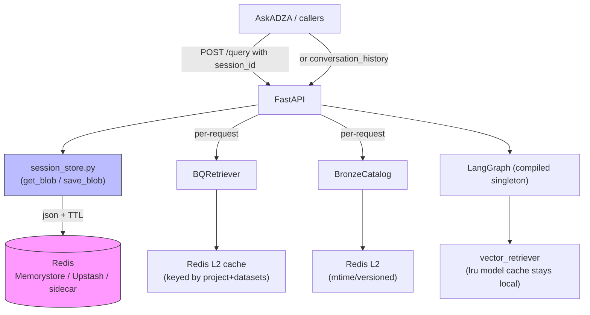

# Redis-Backed Chat Memory & Caching for RAG Production Scaling

## Overview
Replace the two in-memory `_SESSION_STORE` dicts and other process-local caches with a Redis-backed abstraction. This enables horizontal scaling (gunicorn workers, GCE MIGs, Cloud Run), survives restarts, and provides a single source of truth for multi-turn state and reusable lookup data. The client-driven `conversation_history` path remains a fully stateless alternative.

The change keeps the existing pure-function memory compaction logic (`chat_memory.py`) untouched and adds a thin persistence layer.

## Current Problems (from research)
- `ml-eng/ml/rag/app/api.py:58` and `ml-eng/ml/rag/chat_turn.py:25` each maintain a private `dict[str, dict]` + `threading.Lock`. Multi-worker or multi-replica deployments lose or split session state.
- `BQRetriever._schema_cache` (per-instance) and module-global `_cache` in `bronze_dataset_catalog.py` are rebuilt or per-process.
- `lru_cache` singletons for models/embedders are intentionally process-local and stay that way.
- No Redis dependency or config yet; ARCHITECTURE.md only has a placeholder note.
- Duplicated resolve/persist logic between the two stores (one also tracks `stakeholder_type`).

## Proposed Architecture (Mermaid)


## Implementation Todos (in priority order)

1. **Add Redis dependency**  
   Add `redis>=5.2.0` (or latest compatible) to both `ml-eng/requirements.txt` and `ml-eng/ml/rag/requirements.txt`.  
   Update Dockerfile pip step (it will be pulled automatically).

2. **Create shared session + cache facade** (`ml-eng/ml/rag/session_store.py`)  
   - New module exporting:
     - `get_session_blob(session_id: str) -> dict | None`
     - `save_session_blob(session_id: str, blob: dict, ttl_s: int | None = None)`
     - `delete_session(session_id: str)`
     - Optional helpers: `get_redis_client()`, `redis_available()`
   - Backend selection at import time (or first use):
     - If `RAG_REDIS_URL` (or `REDIS_URL`) is set and connectable → Redis JSON/string backend with `ex` TTL.
     - Else → process-local dict (with warning log when used for sessions).
   - Key namespace: `rag:session:{sid}`, `rag:bq:schema:v1:...`, `rag:catalog:bronze:...`
   - Use `redis.Redis` with `connection_pool`, `decode_responses=True`, `socket_connect_timeout`, retry on transient.
   - Support both sync (current FastAPI paths) and note async path for future.
   - Include small unit-testable pure helpers for key naming and (de)serialization.

3. **Migrate production API** (`ml-eng/ml/rag/app/api.py`)  
   - Remove `_SESSION_STORE`, `_SESSION_LOCK`, `_empty_session_blob`, `_resolve_prior_memory`, `_persist_session_turn`.
   - Import from `session_store` (or a thin `chat_session` wrapper that adds the summary/recent shape).
   - Preserve exact public behavior for `session_id` + `conversation_history` fields.
   - Add `stakeholder_type` to the persisted blob for future parity with `chat_turn` (even if AskADZA currently drives it per-request).
   - Update logger messages and the `RAG_DEBUG_SESSIONS` path if needed.
   - Enhance `/ready` to optionally report Redis connectivity when `RAG_REDIS_URL` is configured (non-fatal for liveness).

4. **Migrate / consolidate internal path** (`ml-eng/ml/rag/chat_turn.py`)  
   - Refactor to import and use the same `session_store` facade instead of its private dict.
   - This eliminates the duplication identified in research.
   - Keep `execute_chat_turn` and `ChatTurnResult` APIs unchanged.
   - (If chat_turn is considered internal-only, still do the refactor for consistency; mark the old direct dict as removed.)

5. **Wire BQ schema cache to Redis** (`ml-eng/ml/rag/retrievers/bq_retriever.py`)  
   - Replace or augment the instance `_schema_cache` with calls to a small `get_bq_schema_cache(...) / set_bq_schema_cache(...)` from the new facade (or a `rag_cache` submodule).
   - Key should incorporate project + dataset list hash so different BQ configs don't collide.
   - Long TTL (e.g. 1h or 24h) or manual invalidation via a version key.
   - Keep the existing build logic as the "miss" path.

6. **Wire bronze catalog cache to Redis** (`ml-eng/ml/rag/chatbot/bronze_dataset_catalog.py`)  
   - Make the module `_cache` check Redis first (using content hash or mtime-derived key).
   - On miss, load from YAML as today, then write to Redis.
   - Because the source is a file, keep the mtime check for local dev; Redis acts as cross-process L2.
   - Expose `force_reload` still works (bypass Redis or delete key).

7. **Configuration & environment**  
   - Add to `ml-eng/config/.env.example` (and `config/.env` if appropriate):
     ```
     # Redis for chat sessions + shared caches (required for production scaling)
     RAG_REDIS_URL=redis://localhost:6379/0
     # or rediss:// for TLS / Memorystore
     RAG_SESSION_TTL_SECONDS=86400          # 24h default; 0 or omit = no expiry
     RAG_CACHE_TTL_SECONDS=3600             # for BQ schema / catalogs
     RAG_REDIS_CONNECT_TIMEOUT_S=2
     ```
   - Document in `ml-eng/ml/rag/README.md` (env table) and `local_env.py` comments.
   - In `apply_..._defaults` or a new helper, do not auto-set Redis (explicit opt-in).

8. **Docker & local prod testing**  
   - Update `ml-eng/deploy/docker-compose.prod.yml` to include an optional `redis` service (commented or profile) and wire `RAG_REDIS_URL` to it.
   - Add example volume / healthcheck notes.
   - Update `ml-eng/deploy/README.md`:
     - New "7. Redis for sessions & caches" section (deployment, Memorystore, Upstash, sidecar, auth).
     - Scaling section now mentions "stateless workers + Redis required for multi-turn continuity".
     - Note the `conversation_history` escape hatch for fully stateless clients.
   - Dockerfile: no change needed beyond the requirements pull; add comment about external Redis.

9. **Documentation & observability**  
   - Expand `ml-eng/ml/rag/ARCHITECTURE.md` §12.7 and §14 (Extension points) with the new Redis layer, key design, TTLs, and the facade module.
   - Update the "External session store" row to point at the implemented `session_store.py`.
   - Add a short "Caching strategy" subsection listing what is cached where and why (sessions, schema, catalog; model weights stay on disk + lru).
   - In `ml-eng/ml/rag/docs/SCRIPTS.md` or a new "ops" note, document `redis-cli` smoke commands for debugging sessions.
   - Add structured logs on Redis connect / errors / fallback (gated by existing `RAG_DEBUG` or new `RAG_REDIS_LOG`).
   - Mention in the handoff that AskADZA can continue using `session_id` (now durable) or pass full history.

10. **Testing & verification**  
    - Add lightweight tests under `ml-eng/ml/rag/tests/` (or inline) for the facade: memory backend, Redis backend (via fakeredis or pytest-redis if available, else skip).
    - Manual: start compose with Redis, exercise multi-turn via curl or Streamlit (Streamlit itself unchanged), restart the API container, verify history survives.
    - Verify that with no `RAG_REDIS_URL`, the service still starts and works (with warning).
    - Run existing `run_retrieval_eval`, Streamlit smoke, and `python -m ml.rag.app.api` import checks.
    - After change: `pyright` + any linter on the new file.
    - Update the production smoke curl examples in deploy README to include a follow-up turn using the returned `session_id`.

11. **Migration / rollout notes** (for the software team handoff)  
    - Existing sessions in memory are lost on deploy (expected). Clients using `conversation_history` are unaffected.
    - Recommend deploying Redis (or Memorystore) before or with the first scaled RAG rollout.
    - Canary: set `RAG_SESSION_TTL_SECONDS=3600` initially.
    - Monitoring: track Redis memory, hit rate on session keys, and any fallback warnings.

## Non-Goals / Future
- Semantic/embedding query cache (low ROI; filters make hits rare; can be added later as `rag:embed:v1:...`).
- LLM response caching (risky for factual/advisory answers; not recommended).
- Distributed locking or rate limiting (separate concern).
- Replacing the disk model caches (FASTEMBED_CACHE_PATH / HF_HOME) — those stay on persistent volumes.

## Files Touched (summary)
- `ml-eng/requirements.txt`, `ml-eng/ml/rag/requirements.txt`
- **New**: `ml-eng/ml/rag/session_store.py` (core)
- `ml-eng/ml/rag/app/api.py`
- `ml-eng/ml/rag/chat_turn.py`
- `ml-eng/ml/rag/retrievers/bq_retriever.py`
- `ml-eng/ml/rag/chatbot/bronze_dataset_catalog.py`
- `ml-eng/config/.env.example`
- `ml-eng/deploy/docker-compose.prod.yml`
- `ml-eng/deploy/README.md`
- `ml-eng/ml/rag/ARCHITECTURE.md`
- `ml-eng/ml/rag/README.md`
- `ml-eng/ml/rag/local_env.py` (minor doc)
- `ml-eng/Dockerfile` (comment only)
- Possibly `ml-eng/ml/rag/tests/test_session_store.py` (new)

This plan is sized for a focused 1-2 day implementation pass by one engineer, after which the RAG service is horizontally scalable with durable chat memory and shared caches.
