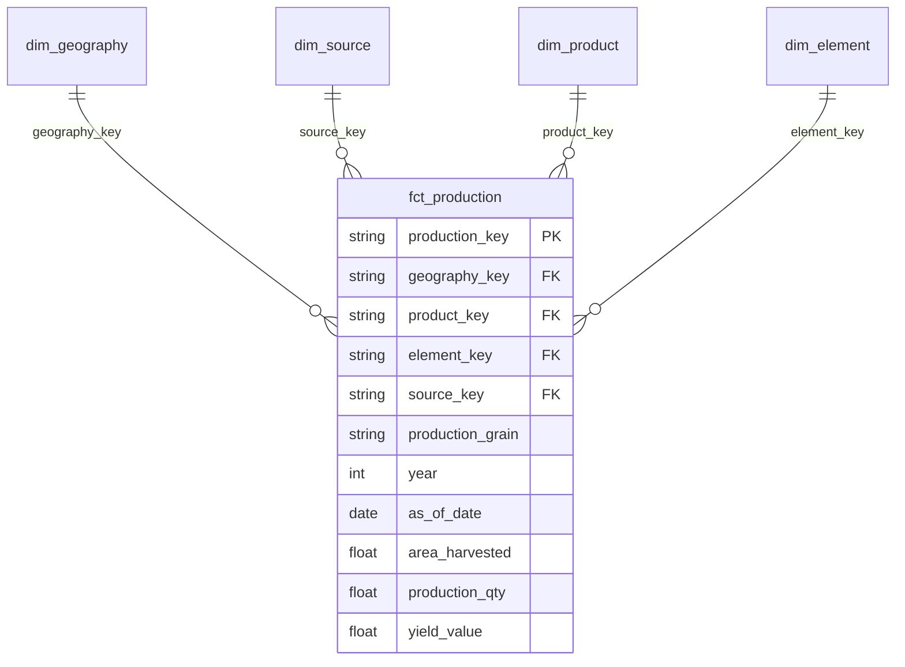
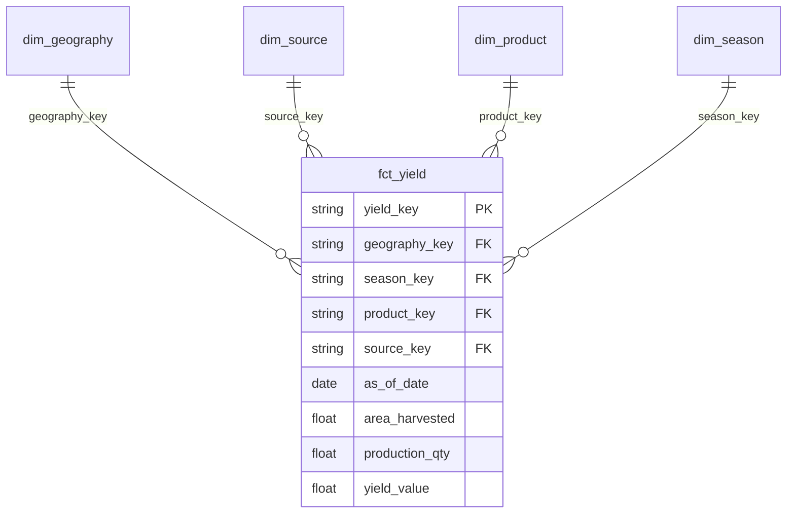
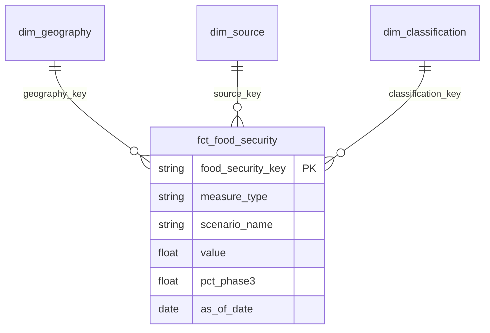
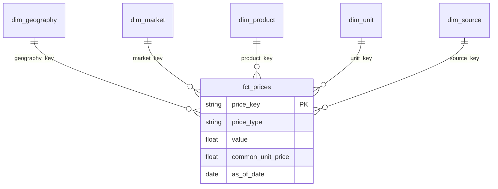
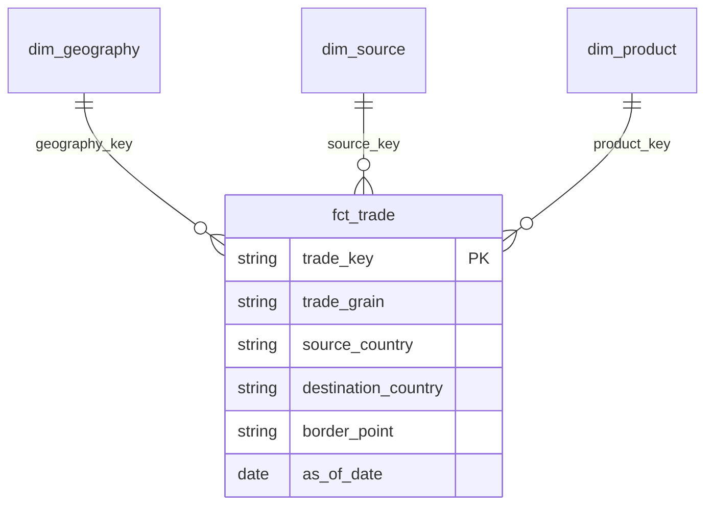
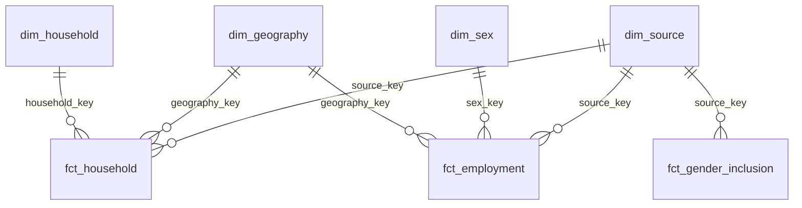
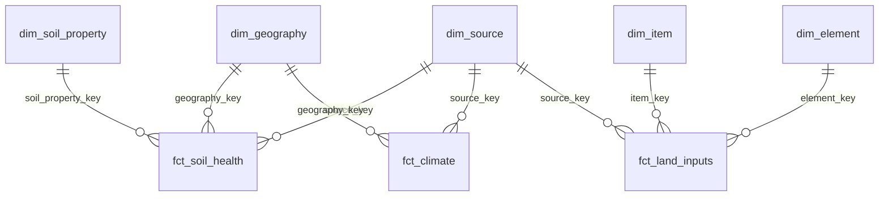

# OpenTrace Africa — mart_dev complete entity dictionary, ERD, and indicator-class analytical guide

**Dataset:** `mart_dev`  
**Version:** warehouse Aug 2026 (post production–yield split; 63 live models)  
**Rule:** every published number states **grain + source_key + as_of_date + unit**.

This document describes **physical mart tables**, how they join, and how to write insight for each **indicator class** (EL, GYI, FVC, FS, PROD, PRC, CLIM, SOIL, AH, VEG, ENV, INP, HDI, BIO, RES).

**Related docs**

| Doc | Role |
|-----|------|
| [OpenTrace_Mart_Complete_Guide.pdf](./OpenTrace_Mart_Complete_Guide.pdf) | Printable PDF of this guide (ERDs as images) |
| [OpenTrace_Mart_Entity_Dictionary.xlsx](./OpenTrace_Mart_Entity_Dictionary.xlsx) | Branded catalogue + indicator-class map + full Columns (with descriptions) |
| [mart_dev_entity_dictionary.xlsx](./mart_dev_entity_dictionary.xlsx) | Engineer dump (Entities / Columns / Relationships / Recipes / ACF) |
| [MART_DEV_OTA_ANALYST_GUIDE.docx](./MART_DEV_OTA_ANALYST_GUIDE.docx) | OTA report-writing playbook |
| [CATALOG_TO_MART_MAP.md](./CATALOG_TO_MART_MAP.md) | Catalog ↔ mart glossary + ACF contract |
| [MART_QA_NOTES.md](./MART_QA_NOTES.md) | QA inventory and known caveats |

---

## 1. How to use the relational database

```text
raw_dev → staging_dev → intermediate_dev → mart_dev
                                              ├── dim_*   (22)
                                              ├── fct_*   (27)
                                              ├── agg_*   (11)
                                              └── bridge_* (3)
```

```sql
SELECT
  g.country_name,
  f.as_of_date,
  -- measures
  s.organisation_name,
  s.tier,
  f.source_natural_key
FROM `project.mart_dev.fct_…` f
LEFT JOIN `project.mart_dev.dim_geography` g ON f.geography_key = g.geography_key
LEFT JOIN `project.mart_dev.dim_source`    s ON f.source_key    = s.source_key
WHERE f.as_of_date BETWEEN DATE '2020-01-01' AND DATE '2024-12-31'
  AND g.country_iso3 = 'ETH'
```

Filter `as_of_date` with a **range** (partition prune). Do not wrap it in `EXTRACT(YEAR …)`.

### Hard rules

1. Do **not** mix FAOSTAT country–year (`fct_production`) with FNID–season (`fct_yield`). They are **separate facts**.
2. On `fct_production`, filter `production_grain` (`physical` | `index` | `gross_value`) before area/qty charts; use `physical` for `agg_production_country_year`.
3. Do not mix IPC `measure_type` population with classification.
4. Do not mix economics `measurement_form` (share / current / constant / growth).
5. Do not average iSDA and ISRIC.
6. Do not present ILRI microdata as national official statistics.
7. Do not blend FEWS / WFP / FAOSTAT prices without keeping `source_key` (and price type/source attributes).
8. On `fct_trade`, filter `trade_grain` (`faostat_country_year` | `fews_border_month`) before blending.
9. `loaded_at` is not ACF freshness unless `as_of_date_basis = 'loaded_at'`.
10. No published fact row without `source_key`.
11. Off-season / décrue / dam ≠ rainfed main season.
12. Child stunting/wasting and labelled regenerative adoption remain **out of scope**.
13. ILRI dairy cow-day milk/calving stays **out** of production/yield facts by design.

### ACF / RAG

Cite **rows used in the answer**. Map:

| ACF | Warehouse |
|-----|-----------|
| tier | `dim_source.tier` (or fact `tier` when present) — 1 global, 2 national, 3 community |
| data_level | fact `data_level` (warehouse row resolution) |
| as_of_date | fact `as_of_date` (+ note `as_of_date_basis`) |
| geo_scope | fact `geo_scope` / `place_scope` (names/labels) — **not** a dim_geography column |
| metric | fact `metric` or product / indicator / element identity |
| magnitude, unit | `value` + `unit` |
| source_id | `source_key` / `source_id` |

---

## 2. Entity catalogue — dimensions

| Table | Holds | Grain | PK |
|-------|--------|-------|-----|
| dim_geography | Country, admin1/2, city, FNID, lat/lon, population; `data_level` | One place | geography_key |
| dim_ref_country | ISO3 reference + Africa scope policy | One ISO3 | country_iso3 |
| dim_faostat_area | FAOSTAT area_code → ISO/M49 attrs | One area_code | faostat_area_key |
| dim_date | Calendar day → year/month/quarter | One day | date_key |
| dim_season | Country-specific season, plant/harvest months, off-season | Country + season | season_key |
| dim_source | Producer, ACF tier, default data_level, lineage | One dataset | source_key |
| dim_product | Crops/commodities + CPC | Product | product_key |
| dim_item | FAOSTAT/macro item | Item | item_key |
| dim_element | FAOSTAT element | Element | element_key |
| dim_indicator | Named series (employment, UNCCD, ASTI, ClimateWatch) | Indicator | indicator_key |
| dim_unit | Units and currencies | Code | unit_key |
| dim_classification | IPC phase + scale | Phase | classification_key |
| dim_market | Marketplaces | Country + market | market_key |
| dim_household | Survey HH attributes (not measures) | Source + hh id | household_key |
| dim_soil_property | Property + depth | Property + depth | soil_property_key |
| dim_livestock | Species | Species | livestock_key |
| dim_disease | Foodborne / hazard names | Name | disease_key |
| dim_aez | AEZ code/name/version | Code + version | aez_key |
| dim_sex | Male / female / total / unknown | Code | sex_key |
| dim_organisation | OpenAIRE + ASTI institutions | Org | organisation_key |
| dim_person | OpenAIRE persons | Person | person_key |
| dim_research_project | OpenAIRE projects | Project | research_project_key |

### dim_geography columns

`geography_key`, `geo_level` (country|admin1|admin2|city|fnid|…), `data_level` (national|sub_national|community|point), `country_name`, `country_iso2`, `country_iso3`, `admin_1_name`, `admin_2_name`, `city_name`, `fnid`, `latitude`, `longitude`, `population`, `capital_status`, `parent_geography_key` / `country_key`, `loaded_at`.

ACF **`geo_scope`** lives on **facts**, not on this dimension.

### dim_source columns

`source_key`, `source_natural_key`, `organisation_name`, `tier`, `default_data_level`, `producer_scale`, `loaded_at`.

Producer scale ≠ row geo_scope ≠ granularity.

### dim_season columns

`season_key`, `country`, `season_name`, `season_name_norm`, `start_month`, `end_month`, `crosses_year`, `is_off_season`, …

Join **yield** on `season_key` (or country + season_name_norm). Do **not** require season on FAOSTAT `fct_production`.

---

## 3. Entity catalogue — facts

| Table | Measures | Grain | Discriminator |
|-------|----------|-------|----------------|
| fct_production | value + element; convenience area_harvested / production_qty / yield_value on physical | FAOSTAT country–year long-form | **production_grain** (physical\|index\|gross_value) |
| fct_yield | area_harvested, production_qty, yield_value | FNID–season (`yield_raw_data`) | — (separate SoT from production) |
| fct_food_security | value, pct_phase3–5 | FNID × month × scenario | measure_type |
| fct_hdi | value (HDI) | country × year | |
| fct_prices | value, common_unit_price | market × product × type × month × source | source / price_type attrs |
| fct_trade | value / flow attrs | faostat_country_year **or** fews_border_month | **trade_grain** |
| fct_soil_health | value | point × property × depth × source | source (iSDA ≠ ISRIC) |
| fct_household | FIES, incomes, food/energy, gender control, diversity | household | project microdata |
| fct_employment | value | country × indicator × sex × year | unit, sex |
| fct_economics | value | country × item × element × year | measurement_form |
| fct_climate | metric + value | point_obs OR country_model | climate_grain |
| fct_land_inputs | value | use / trade / other | input_grain |
| fct_emissions | value | country × item × element × year | |
| fct_food_balance | value + convenience production/imports/exports/food/feed/losses | country × product × element × year | map food/feed/losses by **element_code** |
| fct_animal_health | CDS, incidence, mortality, cost | household × species | |
| fct_food_hazards | samples, prevalence | study × hazard | not farm grain |
| fct_forestry | value | area × item × year | forestry_grain |
| fct_humanitarian | value | recipient × item × year | |
| fct_vegetation | NDVI or carrying_capacity | grid OR site | vegetation_grain |
| fct_gender_inclusion | value | country × year SDG | keep separate from HH gender |
| fct_investment | value | country × year + donor/sex | |
| fct_air_quality | value (e.g. PM) | sensor × timestamp | Nakuru / point |
| fct_biodiversity | counts / attrs | occurrence | |
| fct_protected_areas | area / presence | feature | |
| fct_germplasm | accession presence | accession | |
| fct_machinery | value | country × item × year | |
| fct_insurance | categorical attrs | household × record_type | |

**Common fact columns:** `[fact]_key`, `geography_key` (if spatial), **`source_key`**, `source_natural_key`, **`as_of_date`**, `as_of_date_basis`, ACF fields (`tier`, `data_level`, `place_scope`, `metric`, `source_id`, `geo_scope`), `year`/`month`/`date_key`, measures, `unit`, `loaded_at`.

---

## 4. Aggregates and bridges

| Aggregate | Use |
|-----------|-----|
| agg_production_country_year | National production scorecard (**physical** production only) |
| agg_production_country_season | FNID yield rolled to country × season |
| agg_food_security_country_month | National IPC snapshot (population measure) |
| agg_hdi_latest | Latest HDI |
| agg_prices_country_month | Country-month prices (keep source_key) |
| agg_soil_admin | Admin mean soil, still split by source |
| agg_employment_country_year | indicator × sex × unit × source |
| agg_economics_country_year | item × measurement_form × source |
| agg_emissions_country_year | item × element × source |
| agg_food_balance_country_year | product × source |
| agg_forestry_country_year | forestry_grain × source |

Yield in seasonal aggregates = `SUM(production_qty) / SUM(area_harvested)` from **`fct_yield`**.

| Bridge | Meaning |
|--------|---------|
| bridge_geography_aez | place ↔ AEZ |
| bridge_research_org | OpenAIRE project ↔ organisation |
| bridge_research_person | OpenAIRE project ↔ person |

---

## 5. Full schema ERD (holistic)

```mermaid
flowchart TB
  subgraph DIMS["Conformed dimensions"]
    G[dim_geography]
    DRC[dim_ref_country]
    DFA[dim_faostat_area]
    D[dim_date]
    SE[dim_season]
    SO[dim_source]
    P[dim_product]
    I[dim_item]
    E[dim_element]
    IND[dim_indicator]
    U[dim_unit]
    C[dim_classification]
    M[dim_market]
    HH[dim_household]
    SP[dim_soil_property]
    LV[dim_livestock]
    DIS[dim_disease]
    AEZ[dim_aez]
    SX[dim_sex]
    ORG[dim_organisation]
    PER[dim_person]
    RP[dim_research_project]
  end

  subgraph FACTS["Facts"]
    FP[fct_production]
    FY[fct_yield]
    FFS[fct_food_security]
    FHDI[fct_hdi]
    FPR[fct_prices]
    FT[fct_trade]
    FSH[fct_soil_health]
    FHH[fct_household]
    FEMP[fct_employment]
    FEC[fct_economics]
    FCL[fct_climate]
    FLI[fct_land_inputs]
    FEM[fct_emissions]
    FFB[fct_food_balance]
    FAH[fct_animal_health]
    FFH[fct_food_hazards]
    FFO[fct_forestry]
    FHUM[fct_humanitarian]
    FVEG[fct_vegetation]
    FGI[fct_gender_inclusion]
    FINV[fct_investment]
    FAQ[fct_air_quality]
    FBIO[fct_biodiversity]
    FPA[fct_protected_areas]
    FGE[fct_germplasm]
    FMAC[fct_machinery]
    FINS[fct_insurance]
  end

  subgraph BR["Bridges"]
    B1[bridge_geography_aez]
    B2[bridge_research_org]
    B3[bridge_research_person]
  end

  FP --- G & SO & P
  FY --- G & SO & P & SE
  FFS --- G & SO & C
  FHDI --- G & SO
  FPR --- G & SO & P & M & U
  FT --- G & SO
  FSH --- G & SO & SP
  FHH --- G & SO & HH
  FEMP --- G & SO & IND & SX
  FEC --- G & SO & I & E
  FCL --- G & SO
  FLI --- SO & I & E
  FEM --- SO & I & E
  FFB --- SO & P
  FAH --- HH & LV & SO
  FFH --- SO & DIS
  FFO --- SO & I & E
  FHUM --- SO
  FVEG --- G & SO
  FGI --- SO
  FINV --- SO & IND & ORG & SX
  FAQ --- SO
  FBIO --- SO
  FPA --- SO
  FGE --- SO
  FMAC --- SO
  FINS --- HH & SO
  B1 --- G & AEZ
  B2 --- RP & ORG
  B3 --- RP & PER
```



Paste the mermaid into [mermaid.live](https://mermaid.live) if the renderer caps node count.

### Star: FAOSTAT production (country–year)



### Star: seasonal yield (FNID–season)



### Star: food security



### Star: prices



### Star: trade



### Star: household / gender / employment



### Star: soil / climate / land



---

## 6. Analytical guide by indicator class

Write insights as: **claim + grain + place + period + source + caveat**.

### EL — Economic and livelihood

**Facts:** `fct_employment`, `fct_economics`, `fct_household`  
**Families:** employment in agriculture; income mix; GDP / value-added context.

| Insight type | Query pattern | Do not |
|--------------|---------------|--------|
| Ag employment share | `fct_employment` + indicator + `unit = '%'` + sex | Mix % with 1000 persons |
| Farm vs off-farm income | `fct_household` farm_income, offfarm_income | Treat sample as census |
| Aff value added | `fct_economics` `measurement_form = 'share_of_gdp'` | Mix with current USD |

**Example claim:** “In Ethiopia in 2020, agricultural value added was X% of GDP (FAOSTAT macro, national year).”

### GYI — Gender, youth and inclusion

**Facts:** `fct_gender_inclusion` (national SDG), `fct_household` (control scores), `fct_employment` by sex.

Never union HH control scores into official SDG land-rights rows. State sample vs official.

### FVC — Food system and value chain

**Facts:** `fct_economics` (value added forms), `fct_food_balance` (losses, food vs feed), `fct_prices`, `fct_trade` (`trade_grain`), `fct_forestry` (`forestry_grain`).

- Filter `fct_trade.trade_grain` before border vs national trade claims.  
- Loss insight: `fct_food_balance` losses (via element_code) is SUA disappearance, not measured farm-gate waste.

### FS — Food security and nutrition

**Facts:** `fct_food_security`, `fct_household` (FIES, energy, availability), `fct_humanitarian`, `fct_food_balance` food elements.

| Claim | Source | Caveat |
|-------|--------|--------|
| People in IPC 3+ | fct_food_security measure_type=population | Not classification rows |
| Outlook | scenario_name | Projected ≠ current |
| Household food insecurity | fct_household fies_score | Project sample |
| Child stunting | — | **Out of scope** |

### PROD — Agricultural production

**Facts:** `fct_production` (FAOSTAT country–year) **and** `fct_yield` (FNID–season).  
**Always keep them separate.**

| Claim type | Table / agg | Filter |
|------------|-------------|--------|
| National official-style production | `fct_production` or `agg_production_country_year` | `production_grain = 'physical'` for area/qty |
| Indices / gross value | `fct_production` | `production_grain` in (`index`,`gross_value`) |
| Seasonal subnational yield | `fct_yield` or `agg_production_country_season` | `season_key` / harvest year |

Yield in seasonal rollups: sum production / sum area from **`fct_yield`**.  
Do **not** write “FAOSTAT Meher FNID yield” from `fct_production`.

### PRC — Prices and markets

**Fact:** `fct_prices` — unified over three harmonised feeds (`price_source`: **`fews`**, **`wfp`**, **`faostat`**).  
**Grains:** FEWS = sub-national market × admin × month; WFP = market × country × month (Africa-scoped); FAOSTAT = national country × item × element × month (producer prices, CPI, deflators, exchange rates).  
Keep `source_key`, `price_source`, and price type attributes — do not blend without them.  
`common_unit_price` is FEWS-oriented; null on WFP and FAOSTAT is expected.  
Month must be calendar 1–12 (or null) — not FAOSTAT label codes like 7004.

### CLIM — Climate and weather

**Fact:** `fct_climate`  
Filter `climate_grain`: `point_obs` (NASA/ERA5) vs `country_model` (ClimateWatch).  
Prefer long `metric` + `value`.

### SOIL — Soil health and land

**Facts:** `fct_soil_health`, `fct_land_inputs` (`input_grain`). Prefer `agg_soil_admin` for admin summaries.

- Compare iSDA vs ISRIC; do not average.  
- Land use vs fertilizer trade vs other: filter `input_grain`.  
- AEZ via `bridge_geography_aez` when populated.

### AH — Animal health

**Facts:** `fct_animal_health`, `fct_food_hazards`, `fct_insurance`.

Farm CDS ≠ study-level prevalence. Insurance is mostly categorical (herd band, start year).

### VEG — Vegetation

**Fact:** `fct_vegetation`  
`vegetation_grain`: `ndvi_grid` vs `ilri_site` (carrying capacity). Do not treat NDVI as yield.

### ENV — Environment / emissions

**Fact:** `fct_emissions`  
Filter element (total vs intensity) and keep `source_key`.

### INP — Inputs

Same physical table as land: `fct_land_inputs`  
Fertilizer / pesticide use vs trade (`input_grain` + item). Also `fct_machinery` for stock/use.

### HDI — Human development

**Facts:** `fct_hdi`, GDP via `fct_economics`.  
Country-year only. If `geography_key` / `country_iso3` is null, do not publish a mapped insight until geo resolves (see MART_QA_NOTES). Prefer `agg_hdi_latest` for snapshots.

### BIO — Biodiversity and protection

**Facts:** `fct_biodiversity`, `fct_protected_areas`, `fct_germplasm`.  
Occurrence ≠ national biodiversity index. Germplasm `as_of_date` may be `loaded_at` basis.

### RES — Research system

**Dims/bridges:** `dim_research_project`, `dim_organisation`, `dim_person`, `bridge_research_org`, `bridge_research_person`.  
ASTI researchers/spend: `fct_investment` ASTI branches (sex, degree, institution).

---

## 7. Insight-writing template

```text
Claim: <metric> <direction/magnitude> in <place> during <period>
Grain: <country-year | fnid-season | household | point>
Source: <organisation> (source_natural_key / tier)
Unit: <unit>
Caveats: <grain mix avoided; sample vs official; expected nulls>
ACF inputs present: tier, data_level, as_of_date, geo_scope/place_scope, metric, source_id
```

### Worked examples

**PROD (seasonal):** “Maize yield in Ethiopia Meher 2019 averaged Y t/ha across FEWS FNIDs (`fct_yield` / yield_raw_data). Not comparable to FAOSTAT national maize production (`fct_production`, `production_grain=physical`).”

**PROD (national):** “Nigeria maize production in 2022 was Q tonnes (`agg_production_country_year`, physical grain, FAOSTAT source_key …).”

**FS:** “In [fnid], [month], X% of the population was in IPC Phase 3+ (FEWS population branch). Classification-only rows excluded.”

**EL:** “Agricultural employment share for women in [country] [year] was Z% (`fct_employment`, unit=%, sex=female). Do not add to male share if both are percentages of the same labour force without checking the indicator definition.”

**GYI:** “Female control of farm income in the ILRI [survey] sample was S (`fct_household`). This is not SDG 5.a.1 from `fct_gender_inclusion`.”

**PRC (FEWS market):** “Retail maize price in [market], [admin], [year-month] was P local/unit (`fct_prices`, `price_source=fews`). `common_unit_price` available on this row.”

**PRC (WFP market):** “Retail maize price in [market], [country], [year-month] was P local/unit (`fct_prices`, `price_source=wfp`). No `common_unit_price` on this row.”

**PRC (FAOSTAT national):** “Producer price index for [item] in [country] [year-month] was P (`fct_prices`, `price_source=faostat`, national grain). Not comparable to FEWS market prices without explicit caveat.”

**FVC / trade:** “Cross-border rice flow at [border_point] in [month] used `fct_trade` with `trade_grain=fews_border_month` — not FAOSTAT country-year trade.”

---

## 8. Sparse unions — how to read empty cells

Completeness is **by grain × source**, not table-wide.

| Table | Expected null |
|-------|----------------|
| fct_food_security | pct_phase* on classification rows |
| fct_prices | common_unit_price on WFP/FAOSTAT |
| fct_investment | institution/sex on credit-FDI; item on ASTI |
| fct_climate | unused metric columns on the other climate_grain |
| fct_gender_inclusion | industry/factor on land-rights items |
| fct_production | area/qty/yield convenience cols when element does not match |

Citation keys (`source_key`, `as_of_date`, fact PK) must still be complete.

---

## 9. Out of scope

- Child anthropometry (stunting, wasting, MDD-C)  
- Labelled regenerative / CA adoption  
- Dedicated `fct_market_access` if not built  
- Catalog-only empty dims: policy_area, technology, full pest, farm_practice  
- ILRI dairy cow-day series inside production/yield facts  

---

## 10. Publish checklist

- [ ] Grain stated (and correct fact: production vs yield; trade_grain; climate_grain; …)  
- [ ] source_key resolves in dim_source  
- [ ] as_of_date is observation (or basis flagged)  
- [ ] Units compatible  
- [ ] Discriminator applied (`production_grain`, `measure_type`, `input_grain`, …)  
- [ ] Citations = rows for evidence scoring / ACF
