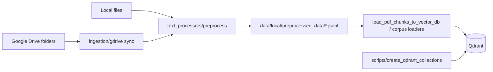

# OpenTrace RAG (`ml/rag`) — architecture

This document explains **how the RAG package is structured**, how data flows at **query time** and **ingest time**, and how components connect. For copy-paste commands and troubleshooting, see [README.md](README.md). For per-script CLI flags and examples, see [docs/SCRIPTS.md](docs/SCRIPTS.md).

---

## 1. Purpose and design principles

The RAG stack answers natural-language questions about African agriculture and food security by combining:

| Source | Technology | Role |
|--------|------------|------|
| **Structured tables** | BigQuery (`BQ_DATASET_BRONZE`) | NL-to-SQL → row-level facts (yields, GDP, trade, etc.) |
| **Unstructured text** | Qdrant Cloud (4 corpora) | News, research/policy reports, BQ table descriptions, OTA insights |
| **Orchestration** | LangGraph in [`chatbot/graph.py`](chatbot/graph.py) | Linear pipeline with one parallel retrieval stage |
| **Generation** | [`llm_chat.py`](llm_chat.py) | LM Studio (`RAG_LLM_BASE_URL`) or Hugging Face router (`HF_API_TOKEN`) |

**Design choices:**

- **Bronze-only SQL** — live queries never target silver/gold; vector chunks may still *describe* other layers.
- **Retrieval uses only the latest user message** — prior turns affect generation via chat memory, not Qdrant/BQ filters.
- **Decomposition drives news geo/time** — academic/BQ table matching use the raw question (plus matcher-specific logic).
- **Table-aware BQ** — vector search over `bq_table_description` chunks → fused hints (YAML + catalog) → NL-to-SQL.
- **Fail-soft LLM** — empty LLM responses trigger fallbacks or “context only” answers; errors are logged, not raised through the graph.

---

## 2. High-level system diagram

### 2.1 Query-time (runtime)

```mermaid
flowchart TB
  subgraph entry [Entry points]
    CLI[run.py CLI]
    ST[streamlit_app.py]
    API[app/api.py FastAPI]
  end

  subgraph graph [LangGraph — chatbot/graph.py]
    D[decompose]
    PR[parallel_retrieve]
    BQ[bq_retrieve]
    M[merge]
    R[rerank]
    G[generate]
    D --> PR --> BQ --> M --> R --> G
  end

  subgraph par [parallel_retrieve threads]
    MT[match_bq_tables_from_descriptions]
    VN[VectorRetriever news]
    VA[VectorRetriever research]
  end

  PR --> MT
  PR --> VN
  PR --> VA

  BQ --> BR[BQRetriever NL-to-SQL + execute]

  subgraph external [External services]
    QD[(Qdrant Cloud)]
    BQDB[(BigQuery)]
    LLM[LM Studio or HF router]
  end

  MT --> QD
  VN --> QD
  VA --> QD
  BR --> BQDB
  D --> LLM
  BR --> LLM
  G --> LLM

  entry --> graph
```

### 2.2 Ingest-time (offline)



---

## 3. Repository layout (`ml/rag/`)

Annotated tree (libraries and tests omitted). Paths are relative to `ml-eng/ml/rag/`.

```
ml/rag/
├── ARCHITECTURE.md          ← this file
├── README.md                ← setup, env tables, run commands
├── docs/
│   ├── SCRIPTS.md           ← script reference
│   ├── BQ_NL2SQL_PLAN.md
│   └── EXPECTED_QUESTIONS.md
├── chatbot/                 ← runtime orchestration + UI
├── retrievers/              ← BQ + Qdrant retrieval
├── text_processors/         ← chunk, preprocess, load to Qdrant
├── ingestion/               ← Drive → preprocess → upsert (rebuild CLI)
├── scripts/                 ← Qdrant collection create / indexes
├── eval/                    ← retrieval@k smoke tests
├── bq_tables_yaml_files/    ← per-table semantic schemas for NL-to-SQL hints
├── helpers/                 ← offline utilities (e.g. YAML generation)
├── app/                     ← FastAPI (`ml.rag.app.api`)
├── graph.py                 ← re-export `run_rag` from chatbot/graph.py
├── run.py                   ← CLI entry
├── api.py                   ← uvicorn target for API
├── paths.py                 ← canonical JSONL paths under ml-eng/data/local
├── local_env.py             ← load ml-eng/config/.env + data/local/.env
├── llm_chat.py              ← unified OpenAI-compatible LLM client
├── sparse_embeddings.py     ← BM25 sparse vectors (hybrid search)
├── chunking_config.py       ← per-corpus profiles (single source of truth)
└── inspect_vector_db.py     ← Qdrant payload inspection
```

---

## 4. Runtime pipeline (`run_rag`)

Implemented in [`chatbot/graph.py`](chatbot/graph.py). Entry: `run_rag(query, **kwargs)` → final `RAGGraphState`.

### 4.1 Graph nodes (in order)

| Node | Function | Reads state | Writes state |
|------|----------|-------------|--------------|
| **decompose** | `decompose_query` | `query` | `decomposition` |
| **parallel_retrieve** | 3× thread pool | `query`, `decomposition`, overrides | `bq_table_candidates`, `vector_news_results`, `vector_academic_results`, `vector_results` |
| **bq_retrieve** | `BQRetriever.retrieve` | `query`, `decomposition`, hints | `bq_results`, (SQL in row metadata) |
| **merge** | concat + labels | BQ + vector lists | `merged_context` |
| **rerank** | `rerank` | `query`, `merged_context` | `reranked_context` |
| **generate** | `generate` | `query`, `reranked_context`, memory | `answer` |

After `bq_retrieve`, the graph aggregates distinct executed SQL strings into **`bq_sql_queries`** (for Streamlit/debug).

### 4.2 `RAGGraphState` fields

| Field | Description |
|-------|-------------|
| `query` | Latest user question |
| `decomposition` | `intent`, `entities`, `geography`, `domains`, `time_start`, `time_end` |
| `bq_table_candidates` | One fused hint dict per matched BQ table (from Qdrant) |
| `vector_news_results` | News chunks |
| `vector_academic_results` | Research corpus chunks |
| `vector_results` | `news + academic` (convenience) |
| `bq_results` | BigQuery rows as context dicts (`metadata.sql`, row fields) |
| `bq_sql_queries` | Unique SQL strings executed |
| `merged_context` | All sources before rerank |
| `reranked_context` | Subset passed to generator |
| `answer` | Final text |
| `geo_override`, `time_*_override` | UI/API overrides for news (and BQ decomposition kwargs) |
| `news_top_k`, `academic_top_k`, `bq_top_k`, `rerank_top_k` | Retrieval limits |
| `conversation_summary`, `recent_turns` | Multi-turn generator memory |
| `chat_history` | Legacy verbatim-only history |

### 4.3 Optional `run_rag` kwargs

Passed from Streamlit, API, or CLI wrappers: `geo_override`, `time_start_override`, `time_end_override`, `news_top_k`, `academic_top_k`, `bq_top_k`, `rerank_top_k`, `conversation_summary`, `recent_turns`, `chat_history`.

---

## 5. Query understanding

### 5.1 [`chatbot/query_decomposer.py`](chatbot/query_decomposer.py)

**Always runs heuristics** (country aliases, relative dates like “past decade”, domain keywords).

**Optional LLM enrichment** when `HF_API_TOKEN` or `RAG_LLM_BASE_URL` is set — merges JSON fields into the heuristic result.

**Output shape:**

```json
{
  "intent": "descriptive|predictive|diagnostic|...",
  "entities": ["..."],
  "geography": ["Nigeria"],
  "domains": ["agribusiness", "economy"],
  "time_start": "2013-01-01",
  "time_end": "2022-12-31"
}
```

**Used by:**

- **News / research** — `resolve_retrieval_geographies()` (one or many countries); multi-country uses `geo_countries` in Qdrant `Filter(should=...)`. Research years use `MatchAny` on KEYWORD `publication_year` (not numeric `Range`).
- **BQ** — passed into `BQRetriever` as `geo_country`, `time_start`, `time_end`, `entities`, `domains` (structured “REQUIRED filters” in NL-to-SQL prompt).

**Not used for:** academic vector filters today (academic also gets geo/time in `graph._retrieve_academic`).

### 5.2 [`chatbot/bq_table_matcher.py`](chatbot/bq_table_matcher.py)

1. Vector search on collection `QDRANT_COLLECTION_DATA_DESCRIPTIONS` with `doc_kind=bq_table_description`.
2. Group hits by `table_name` (from metadata or content).
3. Fuse top narrative snippets with:
   - Rich schema from [`chatbot/bq_table_schema_yaml.py`](chatbot/bq_table_schema_yaml.py) (`ml/rag/bq_tables_yaml_files/*.yml`)
   - Fallback column list from [`chatbot/bronze_dataset_catalog.py`](chatbot/bronze_dataset_catalog.py)

Returns one candidate per table with `content` suitable for `BQRetriever` `table_hints`.

---

## 6. Retrieval subsystems

### 6.1 Vector retrieval — [`retrievers/vector_retriever.py`](retrievers/vector_retriever.py)

**Embeddings:** `sentence_transformers` locally (`RAG_EMBEDDINGS_MODE=local`) or HF feature API.

**E5 prefixing:** news/research use `query:` at search time and `passage:` at index time (see `chunking_config`).

**Hybrid search** (when `RAG_QDRANT_HYBRID_SEARCH=on` and `fastembed` installed):

- Dense + BM25 sparse with RRF fusion (`RAG_HYBRID_*` prefetch limits).
- Payload indexes required on filter fields (see [`scripts/qdrant_collection_specs.py`](scripts/qdrant_collection_specs.py)).

**`vector_search_mode`** (per collection, from profile):

| Mode | Typical collection | Behavior |
|------|-------------------|----------|
| `dense_named` | news, research | Single dense vector name |
| `bq_triple` | BQ_table_descriptions | table / schema / business vectors |
| `ota_triple` | OTA_insights | insight / metric / recommendation |

**Filters** (payload + post-filter): `doc_kind`, `geo_country_primary`, `published_at` range, optional `domains_substring` (news, opt-in via `RAG_NEWS_DOMAIN_FILTER`).

### 6.2 BigQuery retrieval — [`retrievers/bq_retriever.py`](retrievers/bq_retriever.py)

1. Build NL-to-SQL messages (system + user) with:
   - Filter guide, decomposition constraints, table hints
   - Compact schema text when `RAG_BQ_SKIP_LIVE_SCHEMA=on` and hints exist
2. **Modes** (`RAG_BQ_NL2SQL_MODE`):
   - **`per_hint`** (default) — up to `RAG_BQ_MAX_SQL_QUERIES` LLM calls, one per table hint
   - **`batch`** — one LLM call; parse multiple `SELECT`s separated by `---QUERY---`
3. Validate each SQL (SELECT-only, dataset allowlist, LIMIT).
4. Execute against BigQuery; emit rows as context items.

**Fallback:** if no SQL generated, minimal heuristic SQL (`_fallback_sql`) — avoid relying on this for production answers.

**Row budget:** `RAG_BQ_ROWS_PER_QUERY` per query, capped by `bq_top_k` total.

---

## 7. Fusion, reranking, generation

### 7.1 Merge ([`chatbot/graph.py`](chatbot/graph.py))

- BQ rows → `_context_kind=bigquery`, `content` = str(row dict)
- News → prefix `[News]`
- Academic → `[Academic | …]`, `[Policy | …]`, or `[Public report | …]` based on `doc_kind`

### 7.2 Rerank ([`chatbot/reranker.py`](chatbot/reranker.py))

Three modes selected via `RAG_RERANKER_MODE` (default `cross_encoder`):

| Mode | Behaviour |
|------|-----------|
| `cross_encoder` (default, production) | Single batched pass through a cross-encoder. Loads via fastembed first, falls back to sentence-transformers if installed. Model id is configurable via `RAG_RERANKER_MODEL` (default `Xenova/ms-marco-MiniLM-L-6-v2`). Raw scores are min-max normalised to `[0, 1]` and combined additively with a static **source boost** (BQ +0.12, academic/policy/public_report +0.06, OTA insight +0.05, news +0.04, web 0). |
| `llm` | Legacy per-chunk LLM scoring (one `llm_chat_complete` call per chunk). Kept for back-compat / A-B testing — too slow and too expensive for production. |
| `off` | Dev-only pass-through using the static source boost only. |

**Back-compat:** the old `RAG_LLM_RERANK` flag still works when `RAG_RERANKER_MODE` is unset (`on` → `llm`, `off` → `off`).

**Graceful degradation (never raises):**
`cross_encoder` unavailable → `llm` if an LLM backend is configured → `off`.
`llm` requested but no backend → `off`.

Output trimmed to `rerank_top_k` (default 20 in Streamlit), with optional global cap `RAG_RERANKER_TOP_K`.

### 7.2.1 Web fallback ([`retrievers/web_retriever.py`](retrievers/web_retriever.py))

Conditional node after rerank (`RAG_WEB_FALLBACK_ENABLED=1`, off by default).

| Trigger | When |
|---------|------|
| Low chunk count | Usable reranked chunks &lt; `RAG_WEB_FALLBACK_MIN_CHUNKS` (default 3) |
| No news + no BQ | Only academic/OTA (or other) usable chunks remain |
| Low rerank score | Optional: top `_rerank_score` &lt; `RAG_WEB_FALLBACK_MIN_RERANK_SCORE` when `RAG_LLM_RERANK` on |

**Tier 1:** Wikipedia search + REST summary (no API key). **Tier 2:** Tavily news search if Wikipedia empty and `TAVILY_API_KEY` set (optional `langchain-tavily`). Chunks append to `reranked_context` with `_context_kind` `web_wikipedia` or `web_search`. Fail-soft: timeouts/errors return no web chunks.

### 7.3 Generate ([`chatbot/generator.py`](chatbot/generator.py))

- Builds **system + user** messages for OpenRouter / OpenAI-compatible APIs.
- **Context packing:** numbered `[Source N | kind | detail]` labels; rank-weighted char budget (default **12000** total, **3000** per chunk); BQ structured-data chunks get a minimum floor.
- **Prompt:** multi-paragraph synthesis; inline `[Source N]` citations when stating facts from context.
- Calls `llm_chat_complete` with `RAG_GENERATE_MAX_TOKENS` (default **2048**), `RAG_GENERATE_TEMPERATURE` (default 0.5).
- **Sources block:** appended after generation when `RAG_CITATIONS_MODE=referenced` (default) — only sources the model cited inline; set `all` to list every packed source. Covers news, academic, policy/public, OTA, BigQuery structured data, Wikipedia, and Tavily web search.
- On failure: returns OpenRouter-oriented timeout hint + context excerpt.

### 7.4 Chat memory ([`chatbot/chat_memory.py`](chatbot/chat_memory.py))

- Rolling **summary** + last **N verbatim turn pairs** (`RAG_CHAT_VERBATIM_TURNS`, default 5).
- Summary folding uses LLM when configured; else text stub.
- API can store memory server-side by `session_id` (in-process only).

---

## 8. Ingestion architecture

### 8.1 Corpus registry — [`ingestion/collections.py`](ingestion/collections.py)

| CLI `kind` | Corpus key | Qdrant collection (default) | `doc_kind` | Drive env var |
|------------|------------|----------------------------|------------|---------------|
| `news` | `news` | `news_data` | `news_article` | `GDRIVE_FOLDER_NEWS_ID` |
| `research` | `research` | `research_other_papers` | `academic_article`, `policy_document`, `public_report` | `GDRIVE_FOLDER_RESEARCH_PAPERS_ID`, `GDRIVE_FOLDER_OTHER_PAPERS_ID` |
| `data_descriptions` | `data_description` | `BQ_table_descriptions` | `bq_table_description` | `GDRIVE_FOLDER_DATA_DESCRIPTIONS_ID` |
| `ota` | `ota` | `OTA_insights` | (OTA-specific) | `GDRIVE_FOLDER_OTA_INSIGHTS_ID` |

Profiles (chunk sizes, embedding model, vector mode) live in [`text_processors/chunking_config.py`](text_processors/chunking_config.py).

### 8.2 Preprocess output

JSONL files under **`ml-eng/data/local/preprocessed_data/`** (see [`paths.py`](paths.py)):

| File | Corpus |
|------|--------|
| `news_chunks.jsonl` | news |
| `research_chunks.jsonl` | research |
| `data_descriptions_chunks.jsonl` | BQ descriptions |
| `ota_insights_chunks.jsonl` | OTA |

**Manifest:** `ingest_manifest.json` tracks `content_hash` per document for incremental skip.

### 8.3 Chunk JSONL contract

Each line is one JSON object:

| Field | Description |
|-------|-------------|
| `id` | Stable UUID5 (`chunking_config.CHUNK_ID_NAMESPACE`) |
| `text` | Embedded body → stored as Qdrant `content` |
| `metadata` | Payload fields (see below) |

**Common metadata keys:** `document_id`, `chunk_index`, `total_chunks`, `content_hash`, `ingest_version`, `section_path`, `doc_kind`.

**Corpus-specific:** `published_at`, `title`, `country` (news); `table_name` (BQ); `strategy`, bibliographic fields (research).

Loaders: [`text_processors/load_pdf_chunks_to_vector_db.py`](text_processors/load_pdf_chunks_to_vector_db.py) and thin wrappers (`*_load_to_vector_db.py`).

### 8.4 Qdrant collection specs — [`scripts/qdrant_collection_specs.py`](scripts/qdrant_collection_specs.py)

Defines vector layouts (dense names, dims, sparse config) and **`PAYLOAD_INDEXES`** per corpus (e.g. `geo_country_primary`, `published_at`, `country` for research).

Create/backfill via [`scripts/create_qdrant_collections.py`](scripts/create_qdrant_collections.py) (`--indexes-only` for index-only updates).

---

## 9. Per-corpus configuration (runtime)

From [`chunking_config.py`](text_processors/chunking_config.py) `PROFILES` (override via `RAG_EMBEDDING_MODEL_*`, `RAG_QDRANT_VECTOR_SIZE_*`, chunk token env vars):

| Corpus | Collection | Embedding (default) | Dim | Chunk strategy | Vector mode |
|--------|------------|---------------------|-----|----------------|-------------|
| news | `news_data` | `intfloat/multilingual-e5-base` | 384 | `recursive_semantic` | `dense_named` |
| research | `research_other_papers` | `intfloat/multilingual-e5-small` | 384 | `hierarchical_semantic` | `dense_named` |
| ota | `OTA_insights` | `intfloat/multilingual-e5-base` | 384 | `lane_semantic` | `ota_triple` |
| data_description | `BQ_table_descriptions` | `intfloat/multilingual-e5-small` | 384 | `bq_structured` | `bq_triple` |

**Reindex rule:** bump `INGEST_VERSION` in `chunking_config.py` or run loaders with `--reset` after changing chunking or embedding models.

---

## 10. LLM usage matrix

| Step | Module | Backend | When skipped |
|------|--------|---------|--------------|
| Decompose (optional LLM) | `query_decomposer` | `llm_chat` | Heuristics always; LLM optional |
| NL-to-SQL | `bq_retriever` | `llm_chat` | Fallback SQL if empty |
| Rerank | `reranker` | cross-encoder (fastembed / sentence-transformers) by default; `llm_chat` only when `RAG_RERANKER_MODE=llm` | `RAG_RERANKER_MODE=off` |
| Answer | `generator` | `llm_chat` | Context-only message |
| Memory summary | `chat_memory` | `llm_chat` | Text stub |

**Backend selection** ([`llm_chat.py`](llm_chat.py)):

1. If `RAG_LLM_BASE_URL` is set → OpenAI-compatible local server (**LM Studio**).
2. Else if `HF_API_TOKEN` → Hugging Face router.
3. Else → no LLM calls succeed.

`local_env.apply_lm_studio_defaults()` sets safe defaults when `RAG_LLM_BASE_URL` is present (timeouts, generator caps, NL-to-SQL parallelism). It no longer seeds `RAG_LLM_RERANK=off` — the reranker now runs through `RAG_RERANKER_MODE` and defaults to a cross-encoder backend that is independent of the LLM.

---

## 11. Entry points

| Entry | Module | Use |
|-------|--------|-----|
| CLI | [`run.py`](run.py) | `python -m ml.rag.run "question"` |
| Streamlit | [`chatbot/streamlit_app.py`](chatbot/streamlit_app.py) | Interactive UI + pipeline debug |
| API | [`app/api.py`](app/api.py) | `uvicorn ml.rag.api:app` — `POST /query`, sessions |
| Library | [`graph.py`](graph.py) | `from ml.rag.graph import run_rag` |

---

## 12. Configuration reference (consolidated)

### 12.1 Environment loading

[`local_env.load_rag_dotenv`](local_env.py) loads, in order:

1. `ml-eng/data/local/.env`
2. `ml-eng/config/.env`
3. Path defaults (`HF_HOME`, `GOOGLE_APPLICATION_CREDENTIALS`)

Set `RAG_DOTENV_OVERRIDE=1` to force file values over shell exports.

### 12.2 BigQuery

| Variable | Purpose |
|----------|---------|
| `BQ_PROJECT` | GCP project |
| `BQ_DATASET_BRONZE` | Dataset for NL-to-SQL + validation |
| `GOOGLE_APPLICATION_CREDENTIALS` | Service account JSON path |

### 12.3 Qdrant

| Variable | Purpose |
|----------|---------|
| `QDRANT_URL`, `QDRANT_API_KEY` | Cluster access |
| `QDRANT_COLLECTION_NEWS` | Default `news_data` |
| `QDRANT_COLLECTION_RESEARCH_PAPERS` | Default `research_other_papers` |
| `QDRANT_COLLECTION_DATA_DESCRIPTIONS` | Default `BQ_table_descriptions` |
| `QDRANT_COLLECTION_OTA_INSIGHTS` | Default `OTA_insights` |
| `RAG_QDRANT_VECTOR_SIZE_*` | Dense dim per corpus (must match index) |

### 12.4 LLM

| Variable | Purpose |
|----------|---------|
| `RAG_LLM_BASE_URL` | e.g. `http://127.0.0.1:1234/v1` (LM Studio) |
| `RAG_LLM_MODEL_ID` | Must match server model id |
| `RAG_LLM_TIMEOUT_S` | Default HTTP timeout (e.g. 300) |
| `RAG_RERANKER_MODE` | `cross_encoder` (default) / `llm` / `off` |
| `RAG_RERANKER_MODEL` | Cross-encoder model id (default `Xenova/ms-marco-MiniLM-L-6-v2`) |
| `RAG_RERANKER_TOP_K` | Optional global cap on rerank output (`0` = use caller `top_k`) |
| `RAG_RERANKER_MAX_TEXT_CHARS` | Per-chunk char cap fed to the cross-encoder (default 2000) |
| `RAG_LLM_RERANK` | **Legacy.** Honoured only when `RAG_RERANKER_MODE` is unset (`on` → `llm`, `off` → `off`) |
| `RAG_GENERATE_MAX_TOKENS` | Answer length cap (default 2048) |
| `RAG_GENERATE_CONTEXT_MAX_CHARS` | Total context chars to LLM (default 12000) |
| `RAG_GENERATE_CHUNK_MAX_CHARS` | Per-chunk cap before global trim (default 3000) |
| `RAG_GENERATE_TIMEOUT_S` | Generator timeout |
| `RAG_CITATIONS_MODE` | `referenced` (default) or `all` for Sources block |
| `HF_API_TOKEN` | HF router (if no local URL) |

### 12.4.1 Web fallback

| Variable | Purpose |
|----------|---------|
| `RAG_WEB_FALLBACK_ENABLED` | `1` to enable post-rerank Wikipedia/Tavily fallback (default off) |
| `RAG_WEB_FALLBACK_MIN_CHUNKS` | Trigger when usable chunks below this (default 3) |
| `RAG_WEB_WIKI_TOP_K` | Max Wikipedia summaries (default 2) |
| `RAG_WEB_TAVILY_TOP_K` | Max Tavily results when wiki empty (default 2) |
| `RAG_WEB_TOP_K` | Cap total web chunks appended (default 3) |
| `RAG_WEB_TIMEOUT_S` | HTTP timeout per provider (default 8) |
| `RAG_WEB_FALLBACK_MIN_RERANK_SCORE` | Optional rerank score gate (default -1 = disabled) |
| `TAVILY_API_KEY` | Enables tier-2 Tavily (optional; needs `langchain-tavily` for runtime) |

### 12.5 BQ NL-to-SQL

| Variable | Purpose |
|----------|---------|
| `RAG_BQ_MAX_SQL_QUERIES` | Max SELECTs per question (default 10) |
| `RAG_BQ_NL2SQL_MODE` | `per_hint` or `batch` |
| `RAG_BQ_NL2SQL_PARALLEL` | Parallel per-hint calls (`off` for single-slot LM Studio) |
| `RAG_BQ_SKIP_LIVE_SCHEMA` | Use hint-only schema text (faster prompts) |
| `RAG_BQ_ROWS_PER_QUERY` | Rows per executed SQL |
| `RAG_BQ_HINT_MAX_CHARS` | Truncate each table hint in prompt |
| `RAG_BRONZE_MODEL_YAML` | Path to bronze catalog YAML |
| `RAG_BRONZE_MODEL_SOURCE` | dbt source name filter (default `bronze`) |

### 12.6 Retrieval / hybrid

| Variable | Purpose |
|----------|---------|
| `RAG_EMBEDDINGS_MODE` | `local` or `hf_api` |
| `RAG_EMBEDDING_MODEL_*` | Per-corpus embedding model |
| `RAG_QDRANT_HYBRID_SEARCH` | Dense + sparse RRF |
| `RAG_HYBRID_DENSE_PREFETCH` / `SPARSE_PREFETCH` / `FUSION_LIMIT` | Hybrid breadth |
| `RAG_NEWS_DOMAIN_FILTER` | Opt-in strict news domain filter |
| `RAG_NEWS_GEO_FALLBACK` | Retry news without geo if empty |
| `RAG_NEWS_TIME_FALLBACK` | Retry news without date filter if still empty |
| `RAG_RESEARCH_GEO_FALLBACK` | Retry research without geo if empty |
| `RAG_RESEARCH_TIME_FALLBACK` | Retry research without year filter if still empty |
| Compare + 2 countries | Geo fallback disabled so news is not replaced with unrelated regions |

### 12.7 Chat memory

| Variable | Purpose |
|----------|---------|
| `RAG_CHAT_VERBATIM_TURNS` | Verbatim Q/A pairs in prompt |
| `RAG_CHAT_HISTORY_MAX_CHARS` | Verbatim block cap |
| `RAG_SUMMARY_MAX_CHARS` | Summary cap |
| `RAG_SUMMARY_MODEL_ID` | Optional separate summary model |

---

## 13. Operational playbooks

### 13.1 First-time developer setup

1. `pip install -r ml-eng/requirements.txt` (and `ml/rag/requirements.txt` for preprocess extras).
2. Copy `ml-eng/config/.env.example` → `ml-eng/config/.env`; set Qdrant, BQ, `RAG_LLM_BASE_URL`.
3. `PYTHONPATH=ml-eng python -m ml.rag.scripts.create_qdrant_collections`
4. Preprocess + load corpora (see [docs/SCRIPTS.md](docs/SCRIPTS.md)) or `ingestion.cli rebuild`.
5. `PYTHONPATH=ml-eng streamlit run ml/rag/chatbot/streamlit_app.py`

### 13.2 Reindex one corpus after chunking change

1. Bump `INGEST_VERSION` in `chunking_config.py` **or** delete manifest entries.
2. Re-run preprocessor → JSONL.
3. Run `*_load_to_vector_db.py --reset` for that corpus.
4. Run `ml.rag.eval.run_retrieval_eval` for smoke check.

### 13.3 Debug “no BQ rows” / wrong country

1. Streamlit **pipeline debug** → check **BQ SQL queries** count and SQL text.
2. Confirm `RAG_LLM_BASE_URL` and model id; NL-to-SQL empty → fallback SQL.
3. Confirm `BQ_PROJECT`, credentials, `BQ_DATASET_BRONZE`.
4. Set logging; check `bq_retriever` warnings for “0 queries from N hints”.
5. Ensure decomposition shows correct `geography` / `time_*` (word-boundary country extraction).

### 13.4 Debug slow queries

1. `RAG_RERANKER_MODE=off` (debugging aid only; production should stay on `cross_encoder`).
2. Lower `RAG_BQ_MAX_SQL_QUERIES` (e.g. 3) or use `RAG_BQ_NL2SQL_MODE=batch`.
3. Reduce Streamlit `academic_top_k`, `rerank_top_k`.
4. Keep `RAG_BQ_NL2SQL_PARALLEL=off` on single-GPU LM Studio.

---

## 14. Extension points

| Goal | Where to change |
|------|-----------------|
| New Qdrant corpus | `chunking_config.PROFILES`, `ingestion/collections.py`, `qdrant_collection_specs.py`, loader wrapper |
| New graph node | `chatbot/graph.py` `build_graph()` |
| Stronger reranker | `chatbot/reranker.py` (cross-encoder) |
| Reserved BQ slots in context | `graph.node_merge` / `reranker` policy |
| External session store + shared caches | `ml/rag/session_store.py` (Redis facade with memory fallback); used by `app/api.py`, `chat_turn.py`, `bq_retriever.py`, `bronze_dataset_catalog.py` |

---

## 15. Related documentation

| Document | Contents |
|----------|----------|
| [README.md](README.md) | Install, env tables, command cookbook |
| [docs/SCRIPTS.md](docs/SCRIPTS.md) | Every CLI/module entry point |
| [docs/BQ_NL2SQL_PLAN.md](docs/BQ_NL2SQL_PLAN.md) | Bronze NL-to-SQL design notes |
| [docs/EXPECTED_QUESTIONS.md](docs/EXPECTED_QUESTIONS.md) | Example question types |

---

*Last expanded: architecture + scripts split for `ml/rag` only. For `ml-eng/` outside `ml/rag`, see [ml-eng/README.md](../README.md) and [ml/README.md](../ml/README.md).*
